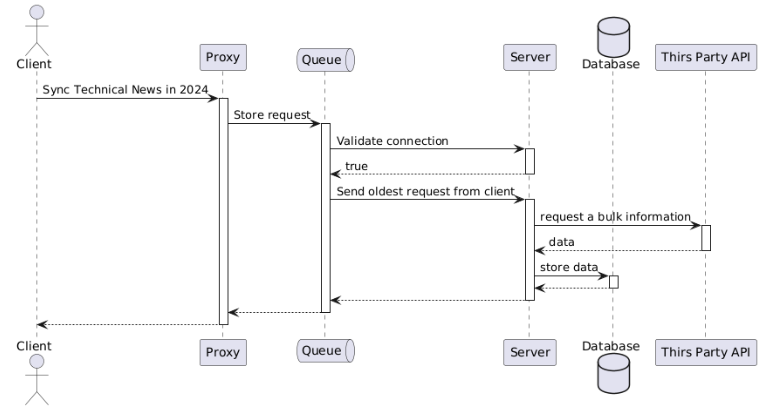

# Air Quality App for Sports Enthusiasts

This app recommends optimal walking routes by utilizing real-time air quality data.
Based on the IQAir API, it analyzes real-time Air Quality Index (AQI), pollutant levels (PM2.5, PM10, ozone, etc.), and air quality forecasts to provide users with the cleanest and most comfortable walking paths.

## The API allows the app to :
  + Check real-time air quality for your current location or selected walking routes.
  + Get detailed pollutant information and predict future air quality changes.
  + Receive alternative walking route recommendations based on real-time data for cleaner air.

# Overview

The Air Quality App for Sports Enthusiasts is designed to help users stay informed about air quality while engaging in outdoor activities such as running, cycling, or hiking. The app provides real-time air quality updates along chosen routes and offers recommendations for alternative routes with cleaner air.

By integrating with GPS and air quality APIs, the app ensures that users can make informed decisions about their outdoor workouts, helping them avoid areas with high pollution levels. Additionally, users receive real-time alerts when air quality drops below safe levels, allowing them to modify their routes accordingly. The app also integrates with popular fitness tracking apps to combine workout performance data with air quality insights, creating a seamless experience for fitness and health-conscious individuals.

# Keyfeature

## Real-Time Air Quality Insights
 + Check real-time air quality data for your current location or selected outdoor routes.
 + Get detailed pollutant information (AQI, PM2.5, PM10, ozone, etc.).
 + Receive air quality forecasts to plan safer workout routes in advance.
## Smart Route Recommendations
 + Identify alternative walking or running routes based on real-time air quality data.
 + Avoid high-pollution areas and find the cleanest outdoor paths for your activities.
 + Ensure safer outdoor workouts with dynamic route suggestions based on air pollution levels.
## GPS & API Integration
 + Seamless integration with GPS for precise route tracking.
 + Access real-time air quality data from trusted sources like IQAir API & Seoul Open Data Plaza.
 + Sync with fitness tracking apps to combine workout performance with environmental data.

# User Stories

| User stories | Description | Estimate |
|:---|:---|:---|
| Documentation - API research | Design | |
| Documentation - System Architecture | Refer to the diagram | 1 hour |
| Documentation - Environment Details of the Proxy Server | <ul><li>The proxy server is configured using HAProxy 2.7.</li><li>SSL/TLS encryption is utilized to enhance security during data transmission through the proxy server.</li><li>All traffic logs are recorded in `/var/log/haproxy.log`, and server status is monitored via Prometheus.</li></ul> | 2 hour |
|Documentation -Queue Server| **Message Broker Software**<br>- Based on the AMQP protocol, utilizing queues, exchanges, and routing keys to distribute and manage messages.<br>- Used in **microservices** and **event-driven architectures**. <br><br> **Proxy to Queue Request Transmission** <br> - Ensures smooth communication when the proxy server sends data to the queue (request queue). <br><br> **Fine Dust Information for Seoul and Jeju** <br> - Retrieves one piece of fine dust information each for **Seoul** and **Jeju** from the queue. <br><br> **Sequential Transmission & Delay Testing** <br> - Sends the first request, introduces an intentional delay, and then sends the second request to verify whether the overall **flow** operates correctly.| 1 hours |
|Documentation - API Server | Language: Python <br> Linux Server: Ubuntu | 1 hours |
|Documentation - DB | Database Type & Version: MySQL 8.0 <br> Server Environment: Ubuntu 20.04 <br> Host: localhost <br> Port: Default (3306) <br> User: root | 30min |
|Documentation -Detail | 1. Login <br> 2. Search for Good/Poor Air Quality on Walking Routes - Utilize goverment-provided API | 1 hours |
| Documentation - API Docs | *App Purpose & Features* <br> 1. Real-time Air Quality Information <br> Recommended Route Guidance <br> 3. Route Notification Feature <br> -> Supports healthy outdoor activities and optimizes workouts and walking routes. | 1 hours |
| Test case | *Air Quality Search & Data Verification* <br> *Recommended Route Guidance Test* | 1 weeks |
| Code Implementation | coding | 5 weeks |

# Documentation - API Research

## 1. IQAir API

https://www.iqair.com/commercial-air-quality-monitors/api

### Introduction

The IQAir API delivers real-time air quality data, allowing users to retrieve AQI, concentrations of key pollutants (such as PM2.5, PM10, CO, NO2, SO2, O3), and weather information. Users can request data for specific cities, countries, or use GPS coordinates to get information for a precise location.

### Features and Endpoint

 + /v2/city : Retrieve air quality data for a specific city
 + /v2/nearest_city : Get air quality data for a specific
 + /v2/geo: Retrieve data based on GPS coordinates
 + /v2/countries: List of all available countries
 + /v2/states: List of states within a country
 + /v2/cities: List of cities within a state

### Call limitation

 + 5/minute
 + 500/day
 + 10,000/month

### Response Format

 + All requests return data in JSON format.
 + An API key is required, and an authentication token must be included in the request.

## 2. Seoul Open Data Plaza API

https://data.seoul.go.kr/dataList/OA-2501/S/1/datasetView.do

### Introduction

Seoul Open Data Plaza API provides public data related to various administrative and urban services within Seoul. Users can access structured datasets for research, development, and analytics.

### Response Format

 + JSON or XML format
 + Requires API key for authentication

### Authentication

 + API key required
 + Must include the API key in the URL for aythentication

# Documentation - System Architecture



# Documentation - Proxy server Environment Details

 + Proxy Software :  HAProxy 2.7
 + Operating System : Ubuntu 20.04
 + SSL/TLS Encryption: Enabled for secure data transmission
 + Logging: All traffic logs are recorded in /var/log/haproxy.log

# Documentation - Queue server Enviroment Dtails

 + Queue Software : RabbitMQ
 + Protocol : AMQP(RabbitMQ)
 + Operating System : Ubuntu 20.04
 + User : admin

# Documentation - API Server Environment Details

 + Programming Language : Python
 + Operating System : Ubuntu 20.04
 + Host : localhost
 + Database : MySQL 8.0
 + Reverse Proxy : HAProxy

# Documentation - Database Environment Details

 + Operating System : Window10 (Client) / Ubuntu (Database Server)
 + Database Software : MySQL 8.0
 + Connection Method : Python to MYSQL using mysql-connector-python
 + Installation Command : pip install mysql-connector-python

# Database - Table Design

## Search info Table

A table for storing user information, including the user's name, location, and preferred workout course.

| Column Name | Data Type | Description |
|:---|:---|:---|
| id | INT | Primary Key, User ID |
| region_city | VARCHAR(100) | User's city |
| region_district | VARCHAR(255) | User's detailed location |
| preferred_route | VARCHAR(255) | Preferred workout route |
| air_quality | TIMESTAMP | Air quality record |
| created_at | TIMESTAMP | Registration date |

## Average info Table

The average_info table stores aggregated air quality data for different walking routes over a specified time range. It helps in analyzing long-term trends and recommending optimal routes based on air quality conditions.

| Column Name | Data Type | Description |
|:---|:---|:---|
| id | INT(Primary Key, AUTO_INCREMENT) | Unique identifier for each record |
| route_name | VARCHAR(255) | Name of the walking route |
| average_aqi | FLOAT | Average Air Quality Index (AQI) for the route |
| average_pm25 | FLOAT | Average Air Quality Index(AQI) for the route |
| average_pm10 | FLOAT | Average PM10 concentration |
| average_o3 | FLOAT | Average Ozone (O3) concentration |
| time_range | VARCHAR(50) | Time period over which the average values are calculated |
| recommend_score | FLOAT | Score based on air quality |
| last_updated | TIMESTAMP | Last update timestamp |

# Documentation - Details

## 1. Seoul Doodream Trail API
### Overview
 + API Name : Seoul Doodream Trail API
 + Purpose : Provides walking trail information in Seoul
 + Base Endpoint
   ```
   http://openAPI.seoul.go.kr:8088/{API_KEY}/xml/SeoulGilWalkCourse/1/10
   ```
 + Request Method : `GET`
 + API Key Required : `SEOUL_API_KEY`

### Required Parameters
| Parameter | Description | Example |
|:---|:---|:---|
| `lat` | Latitude(WGS84) | `37.5665` |
| `lon` | Longitude(WGS84) | `126.9780` |
| `key` | Your registered API key | requested API key |

## 2. IQAir API

 + API Name : IQAir AirVisual API
 + Purpose : provideds air quality data for a given latitude & longitude
 + Base Endpoint
   ```
   http://api.airvisual.com/v2/nearest_city
   ```
 + Request Method : `GET`
 + API Key Required : `IQAIR_API_KEY`

### Required Parameters
| Parameter | Description | Example |
|:---|:---|:---|
| `lat` | Latitude(WGS84) | `37.5665` |
| `lon` | Longitude(WGS84) | `126.9780` |
| `key` | Your registered API key | requested API key |

# Documentation - API Docs

## 1. Purpose of the App

### Supporting Healthy Outdoor Activities

 + Provides users with real-time air quality information around their current location and destination.
 + Recommends walking routes with optimal air quality to ensure a safe and healthy outdoor experience.

### Optimizing Exercise & Walking

 + Suggests the best routes for walking, running, and other outdoor activities based on real-time air quality data.
 + Encourages a healthier lifestyle by guiding users toward cleaner outdoor environments.

## 2. Key Feature

### Real-Time Air Quality Monitoring

 + Uses Seoul's public data API to provide real-time air quality conditions for users' locations and selected routes.

### Smart Route Recommendation

 + Suggests optimal walking or running routes based on current air quality, fine dust levels, and user activity preferences(e,g.walking, jogging)
 + Analyzes air quality data across multiple routes to identify the safest and cleanest path.

### Air Quality Alerts

 + Provides real-time notifications based on user-defined thresholds for air quality changes.
 + Helps users make informed decisions about their outdoor activities by alerting them when conditions deteriorate.

## 3. Additional Feature Suggestions

### Air Quality Prediction

 + Utilizes AI models to forecast air quality trends, allowing users to plan their outdoor activities in advance based on predicted conditions.

### Community Feature

 + Enables users to share experiences and reviews of specific routes.
 + Leverages user feedback to suggest additional recommended routes based on collective experiences.

### Environmental Comfort Index

 + In addition to air quality, the app visualizes an environmental comfort index by considering factors such as green spaces, proximity to water bodies, and well-maintained surroundings.
 + Helps users choose more comportable and pleasant routes for their outdoor activities.

## 4. API Request & Response

### Request
#### Get Average Air Quality

| HTTP Method | Endpoint |
|:---|:---|
| `GET` | /average?course_name={COURSE_NAME} |

+ Request Example
  
`curl -X GET "https://api.airquality.com/v1/average?course_name=hanriver&api_key=YOUR_API_KEY"`

+ Request Parameters

| Parameter | Type | Required | Description |
|:---|:---|:---|:---|
| course_name | String | ✅ | trail name |
| ai_key | String | ✅ | API authentication key |

+ Response: Get Average Air Quality
  
```
{
  "Course_name": "hanriver",
  "average_aqi": 65.4,
  "average_pm25": 38.2,
  "time_range": "09:00-18:00",
  "recommend_score": 72.3,
  "data_source": "IQAir, Seoul Open Data Plaza",
  "last_updated": "2025-01-22T12:00:00Z"
}
```

# Response

## Recommended API Response Example(JSON)

```
{
    "status": "success",
    "total_results": 5,
    "recommended_walk_courses": [
        {
            "name": "Gwanaksan Jarak-gil (Barrier-free Forest Trail)",
            "distance": "1.3km",
            "lead_time": "30 minutes",
            "latitude": 37.4669,
            "longitude": 127.4478,
            "air_quality": {
                "aqi": 70,
                "status": "Moderate",
                "main_pollutant": "PM2.5"
            }
        }
```

### Explanation of the JSON Response
| Key | Description | Example Value |
|:---|:---|:---|
| `status` | Indicates whether the request was successful | `success` |
| `total_results` | The number of walking trail that meet the criteria | `5` |
| `recommended_walk_courses` | List of recommended trails with air quality info | `[...]` |
| `name` | Name of the walking trail | `관악산 자락길(무장애숲길)` |
| `distance` | Trail length | `"1.3km"` |
| `lead_time` | Estimated walking time | `"30 minutes"` |
| `latitude` | Converted WGS84 latitude | `37.4669` |
| `longitude` | Converted WGS84 longitude | `127.4478` |
| `air_quality.aqi` | Air Quality Index(AQI) value | `70` |
| `air_quality.status` | AQI status (Good, Moderate, Unhealthy, etc) | `"Moderate"` |
| `air_quality.main_pollutant` | Main air pollutant affecting the area | `"OM2.5"` |

### Why Does `main_pollutant` Differ Between Locations?

The `main_pollutant` value in the IQAir API response varies based on the dominant air pollutant at a specific location at the time of the request.
